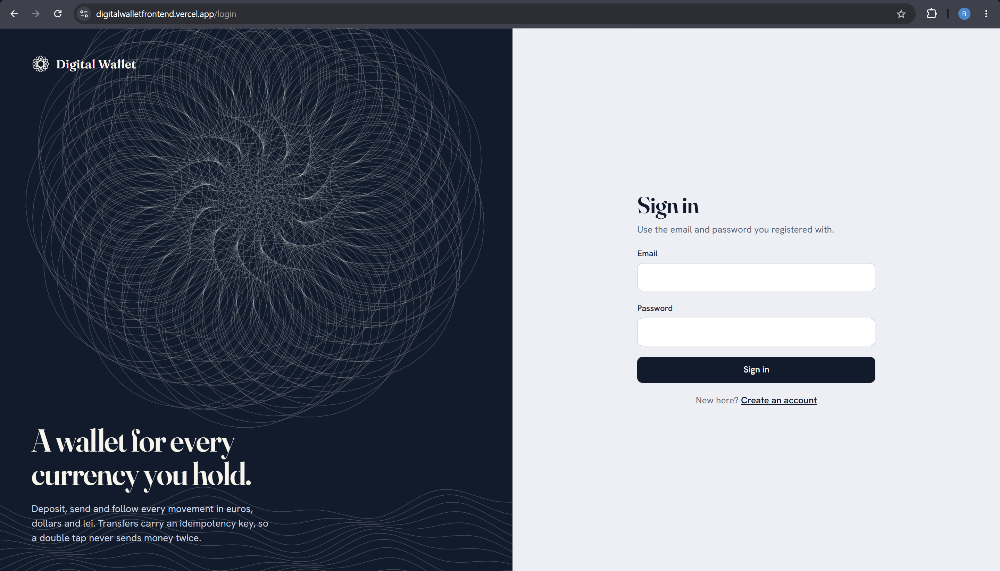
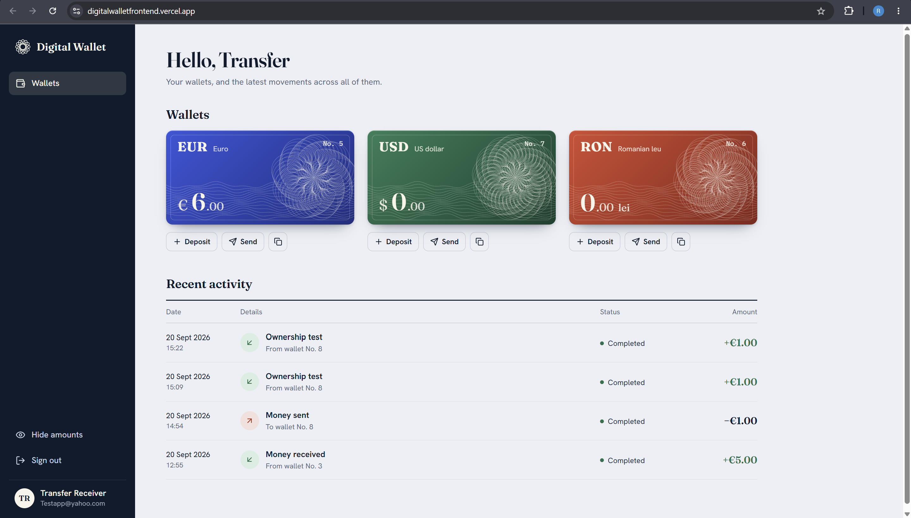
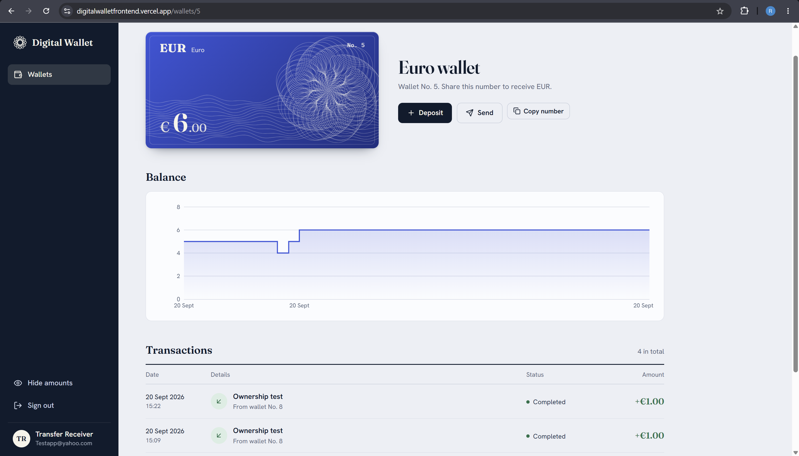

# Digital Wallet — Frontend

A **React + Vite** single-page client for the [Digital Wallet API](https://github.com/RazvanBogdan28/Digital-Wallet-API), a Spring Boot backend for user authentication, multi-currency wallets, deposits and idempotent transfers.

The client focuses on **clean state management, resilient API handling (automatic token refresh, retry-once-on-401) and a distinctive, editorial visual identity** rather than a generic dashboard look.

## Live Demo

- **App:** https://digitalwalletfrontend.vercel.app
- **Backend API:** https://digital-wallet-api-production-2f16.up.railway.app
- **Backend Swagger UI:** https://digital-wallet-api-production-2f16.up.railway.app/swagger-ui/index.html
- **Backend repo:** https://github.com/RazvanBogdan28/Digital-Wallet-API

Create an account on the live app to try it — registration is open, and wallets start at a balance of 0.

## Screenshots

| Sign in | Dashboard |
|---|---|
|  |  |

| Wallet detail |
|---|
|  |

## Features

- Email/password registration and sign in
- Stateless JWT auth with silent, single-flight **access token refresh** on 401 — a user is never bounced to the login screen mid-session just because their access token expired
- Multi-currency wallets (EUR, USD, RON), one per currency per user
- Deposits and wallet-to-wallet transfers, with a client-generated **Idempotency-Key** per transfer so a double-tap or a retried request never sends money twice
- Paginated transaction history with a derived balance-over-time chart
- Wallet **ownership enforcement** reflected in the UI — attempting to open another user's wallet shows a clear "you do not have access" state instead of leaking data
- Admin view listing all users and, on demand, their wallets (role-gated, hidden entirely from non-admin accounts)
- "Hide amounts" privacy toggle, persisted locally, for using the app in public
- Toast notifications, inline form validation, and human-readable error messages mapped from the API's structured error responses
- Responsive layout with a print/export-style "wallet card" visual per currency

## Tech Stack

- React 18
- Vite
- React Router
- Recharts (balance chart)
- lucide-react (icons)
- Vercel (hosting, with `vercel.json` rewrites)

## Architecture

```text
src/
├── App.jsx                 route table + auth/admin route guards
├── main.jsx                app entry, providers
├── lib/
│   ├── api.js               fetch wrapper: auth header, error mapping, token refresh + retry
│   ├── auth.jsx              AuthProvider — session state, login/register/logout, admin detection
│   ├── privacy.jsx           "hide amounts" toggle, persisted to localStorage
│   ├── ledger.js              transaction list → chart series / table rows
│   └── format.js              currency + date formatting helpers
├── pages/
│   ├── AuthPage.jsx           sign in / register
│   ├── Dashboard.jsx          wallet overview + recent activity
│   ├── WalletPage.jsx         single wallet: balance chart, deposit, send, paginated history
│   └── AdminPage.jsx          admin-only user directory
└── components/                 wallet "card" visuals, deposit/send sheets, toasts, ledger table, etc.
```

### Session handling

All authenticated requests go through a single `request()` helper in `lib/api.js`:

1. Attaches `Authorization: Bearer <accessToken>` from the in-memory/localStorage session.
2. On a `401`, triggers **one** shared refresh call (concurrent 401s await the same in-flight refresh instead of each starting their own) and retries the original request exactly once with the new token.
3. If the retry also fails, the session is cleared and the user is routed back to sign in — otherwise, expired tokens are invisible to the user.

### Ownership and roles in the UI

The backend enforces wallet ownership and admin-only routes; the frontend mirrors this defensively:

- `WalletPage` renders a dedicated "Wallet unavailable" state on a `403`, rather than a generic error.
- `/admin` is guarded client-side by the token's role and hidden from navigation for non-admins — the backend remains the actual source of truth and re-checks the role on every request.

## Running Locally

### Requirements

- Node.js 18+
- The backend running somewhere reachable (locally, or the deployed Railway instance)

### Setup

```bash
npm install
cp .env.example .env
npm run dev
```

By default `VITE_API_URL` is left empty, so the Vite dev server proxies any `/api/...` call to the backend defined in `VITE_PROXY_TARGET` (the deployed Railway API by default) — this avoids CORS entirely during local development. Point `VITE_PROXY_TARGET` at `http://localhost:8080` instead if you're also running the backend locally.

The app runs at:

```text
http://localhost:5173
```

### Build

```bash
npm run build
npm run preview
```

## Deployment

The app is deployed on **Vercel**, connected to this repository for automatic deployment on every push to `main`. `vercel.json` rewrites `/api/*` requests to the Railway-hosted backend, so the deployed frontend also talks to the API same-origin, without needing `VITE_API_URL` set or CORS configured for cross-origin calls.

## Related Project

This client is the frontend half of a full-stack portfolio project. See the [Digital Wallet API](https://github.com/RazvanBogdan28/Digital-Wallet-API) repository for the Spring Boot backend, its architecture, and API documentation.

## Project Goals

This project demonstrates frontend development concepts such as:

- consuming a JWT-secured REST API from a single-page app
- resilient session handling (silent token refresh, single-flight requests)
- role- and ownership-aware UI states
- idempotent write operations from the client side
- component-driven UI without a heavyweight framework
- static-site deployment with API rewrites

## Future Improvements

Possible future additions:

- automated end-to-end tests (Playwright/Cypress) covering the ownership and admin flows
- optimistic UI updates for deposits/transfers
- dark mode
- account settings (password change, profile info)
